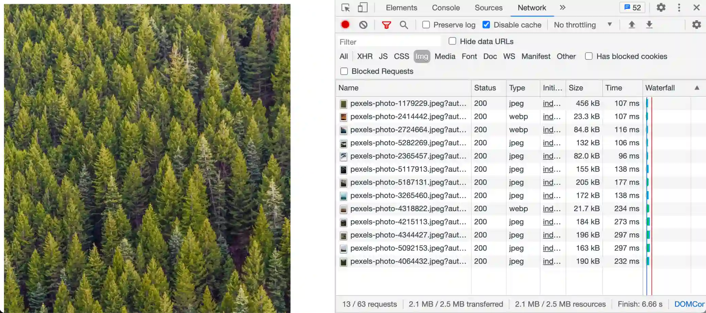

在使用 chrome 的 lighthouse 对网站进行测速之后，发现有一条优化提示：推迟屏幕外的图片加载。之前有看到过要实现这样的效果需要使用 lazy loading，图片懒加载，但是需要使用 js 的方式来实现，由于本人十分懒惰，不想用太复杂的代码，于是在网上搜索了一番，发现 ``  标签原生支持懒加载。

## 为什么要懒加载

浏览器在加载图片的时候本身是 async 异步的，不会阻塞浏览器的加载进程，但是屏幕外的图片加载仍然会消耗带宽，这样在带宽有限的情况下，会影响重要组件的加载，例如 CSS、JavaScript 等，进而拖慢页面的加载。

<!-- truncate -->

## 解决办法

``  标签原生支持 loading 属性，它的属性可以取的值有：

- eager：无论图片是否在可视区域，都会直接加载图片。
- lazy：推迟图片的加载，当图片滚动到距离可视区域一定阈值（视浏览器的实现而定）的时候，再加载图片。
- auto：由浏览器自行决定。

通过这些属性的描述来看，我们只需要给 ``  标签的 loading 属性设置为 lazy 即可。我们来测试一下，假设有下面的 html 页面，加载了一系列的图片，需要滚动才能显示全部。如果不设置 loading 为 lazy，那么图片会直接全部加载。从开发者工具的 Network 中可以看到：

如果给屏幕外的图片设置 loading 为 lazy，那么可以看到只有在滑动到图片快要出现的时候，图片才会加载：

<Video src={require("./img/2021-03-23-web-performance-optimization-image-lazy-loading/showcase.mp4").default} webmSrc={require("./img/2021-03-23-web-performance-optimization-image-lazy-loading/showcase.webm").default} />

要注意的是，不要给首屏出现在可视区域的图片设置懒加载，因为它本身就在可视区域，应该尽快加载，以让用户尽早看到图片。另外，使用懒加载的图片应该尽量设置宽高，这样可以避免抖动：在等图片加载的时候，相应区域会显示为空白，其他元素不会占位。如果不设置宽高，其它元素就有可能会占位，图片加载完成之后，又会把占位的元素挤下去，造成抖动。

## 浏览器支持

loading 属性还算是一个比较新的属性，主流浏览器基本上都支持了，IE 仍在被排除在外。对于不支持懒加载的浏览器会自动忽略这个属性。具体支持程度可以参加下表：

|  IE   | Edege | FireFox | Chrome | Safari | IOS Safari | Android Browser | Chrome for Android | FireFox for Android |
| :---: | :---: | :-----: | :----: | :----: | :--------: | :-------------: | :----------------: | :-----------------: |
|  No   |  89   |   75    |   77   |   No   |     No     |       89        |         89         |         86          |

import Video from "@site/src/components/Video";