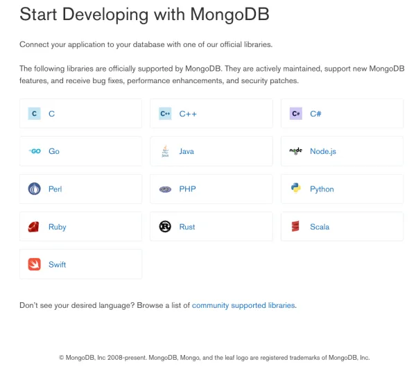
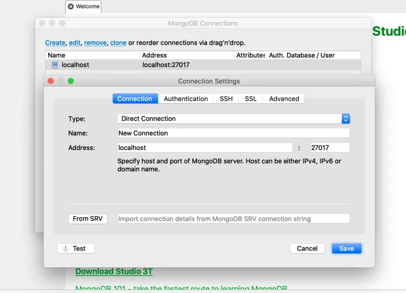
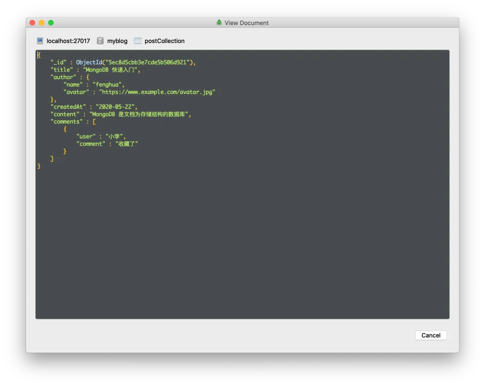
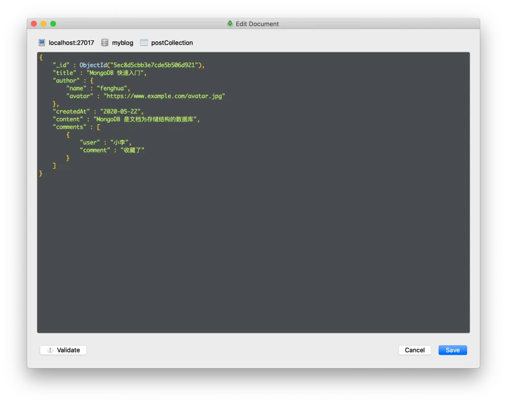

之前分别讲了 Express 和 MongoDB 的使用方法。那么该如何把他们两个结合到一起呢？毕竟把后端应用程序和数据库连起来才能构成一个完整的后端 API。这个视频就教你实现一个完整的后端增删改查 API。要更好的理解视频的内容，你需要熟悉 ES6、ES7 的语法，尤其是 async/await 的用法。

import BVideo from "@site/src/components/BVideo";

<BVideo src="//player.bilibili.com/player.html?aid=625766169&bvid=BV1Et4y1C7BZ&cid=197174039&page=1"/>

## 安装 MongDB Driver

首先一般数据库厂商都有针对各种编程语言提供了一套驱动，这个驱动就是专门为编程语言提供了操作数据库的接口。因为咱们这个 express 是 node.js 的项目，所以咱们得先下载一个 MongoDB 的 node.js 的驱动。

首先咱们看一下它的官网。它上面有关于 Java、C# 和 Node.js 的驱动:



咱们看一下 Node.js 的, 它只需要使用 npm 下载下来就可以了。打开上次的 express 项目，你可以在我的 github 上找到，我把地址贴在视频简介里，在它的基础上咱们添加数据库的操作，首先安装 mongodb 的驱动，

```bash
npm install mongodb --save
```

## 配置 MongoDB 连接

下载完成之后，咱们得先连接到数据库，我们新建一个文件夹：

`config`

这里专门放了一些应用程序的配置文件，在里面新建一个 js 文件：

`mongoDbConnection.js`

这里边写连接到数据库的代码。

首先引入一下 MongoClient 的实例，后面用它来连接数据库：

```javascript
const MongoClient = require("mongodb").MongoClient;
```

再定义一个变量 URL，保存一下 MongoDB 的连接地址：

```javascript
const url = "mongodb://localhost:27017";
```

然后再定一个 dbName 变量，里面存放数据库的名字：

```javascript
const dbName = "myblog";
```

再定一个 `_db`  变量，这个 `_db`  用来存放连接到数据库后，MongoClient 返回的数据库实例，后面要在选择集合的时候用到，这样定义在全局作用域里边就可以复用它，节省创建和销毁连接的时间。

接下来再定一个 async 的函数 `connectDb` ，用来连接到 MongoDB 并选择要操作的数据库。

```javascript
async function connectDb() {}
```

当 `_db` 变量没有值时，我们创建一个新的 MongoClient 实例，把 url 传进去，第二个参数是配置项，设置 `useUnifiedTopology` 是因为 MongoDB 提示 Server Discover and Monitoring engine(服务发现和监控引擎）要过时了，把它设置为 true 可以避免这个警告：

```javascript
if (!_db) {
  const client = new MongoClient(url, { useUnifiedTopology: true });
  try {
    await client.connect();
    _db = await client.db(dbName);
  } catch (error) {
    throw "连接到数据库出错";
  }
}
return _db;
```

接下来调用 client.connect()方法，使用 await 关键字：

```javascript
await client.connect();
```

client.connect()原本接收一个回调函数，回调函数的参数是错误信息，用来表示是否连接成功。不过呢，为了避免回调地狱，我们可以不传递回调函数，那么它就返回一个 Promise，我们就可以使用 async/await 语法编写同步式的代码，其他接收回调的方法也可以这么做。

等他执行完毕之后，数据库就连接成功了，之后再使用 client 里边的 `db`  方法，来选择数据库：

```javascript
_db = await client.db(dbName);
```

把咱们的数据库名字变量传递进去，选择数据库，然后把返回的数据库实例赋给 `_db`  这个变量。这里如果咱们用回调函数形式的话，它会把 db 实例当作参数传给回调函数，那就只能在回调函数里面，继续写业务逻辑，意思就是说在 express 里面的逻辑也都必须要写在这个 cliend.db() 的回调函数里面，这样就会一层一层的，调用回调函数，最终形成回调地狱。

接下来，用 try...catch 来捕获异常，如果连接出错的话，抛出一个字符串，提示连接数据库出错，这些异常最终到抛到 epxress 中，用来反馈给客户端：

```javascript
try {
  await client.connect();
  _db = await client.db(dbName);
} catch (error) {
  throw "连接到数据库出错";
}
```

最后返回 `_db` :

```javascript
return _db;
```

接下来我们导出另外一个函数， `getCollection` ：

```javascript
exports.getCollection = ...
```

这个是用来选择 collection 的。后边我们操作数据的时候会使用到 collection 里面的增删改查的方法。

这个函数接收一个参数 collection：

```javascript
exports.getCollection = (collection) => {};
```

是 collection 的名字，然后返回一个 async 的函数：

```javascript
exports.getCollection = (collection) => {
  return async () => {};
};
```

这个是形成了一个闭包，因为我们需要在外层函数里面保存一下 collection 的实例，这样可以复用 collection。在外层函数中定义一个 `_col`  变量用来保存 collection 实例：

```javascript
let _col = null;
```

接下来在返回的 async 的函数里边，判断 `_col`  是否为 null：

```javascript
if (!_col) {
}
```

如果为 null，就调用 connetDb()方法，别忘了使用 await 关键字，获取 db 实例：

```javascript
const db = await connectDb();
```

然后调用 `db.collection`

```javascript
_col = await db.collection(collection);
```

把 collection 的名字传递进去，并把返回的 collection 保存到 `_col`  中。然后再把这两行，放到 try catch 块里面，处理异常：

```javascript
try {
  const db = await connectDb();
  _col = await db.collection(collection);
} catch (error) {
  throw "选择 collection 出错";
}
```

最后返回 `_col` :

```javascript
return _col;
```

## 编写文章 Model

在连接到数据库之后，就开始编写咱们的 model。 Model 是直接和数据库打交道的，做一些增删改查操作，然后 express 里边，API route 会调用 model 来实现把数据添加到数据库，或者修改和删除数据。这里我们创建一个文章的 Model：

新建一个 Models 文件夹，再在里边新建一个 post.js 文件。

在文件的第一行，引入 getCollection 方法，然后把咱们上次创建好的 `postCollection`  这个集合的名字传递进去，之后它会返回一个 aync 的函数，我们把它保存到 postCollection 变量中，后边增删改查的时候都需要先 await postCollection() 来获取 collection 实例。

```javascript
const postCollection = require("../config/mongoDbConnection").getCollection(
  "postCollection"
);
```

## 保存文章

首先，我们先看一下保存文章。在 models/post.js 中，导出一个 async 的函数，给它一个名字：save，它接收一个参数，就是要保存的文章对象，然后写上 try...catch 代码块用来捕获异常，在 try 里边：

- 第一步，定义一个常量 col，然后使用 await postCollection（）获取 collection 的实例
- 第二步，定义一个常量 result，然后使用 await col.insertOne(post)；方法，添加一条数据到数据库中
- 第三步，返回 result.ops 的第一条记录，result.ops 里保存了所有添加成功的数据，这里因为只有一条，所以返回第 1 个就可以了。

最后在 catch 里边，当文章添加失败时，抛出 *添加文章到数据库出错*  提示。

```javascript
exports.save = async (post) => {
  try {
    const col = await postCollection();
    const result = await col.insertOne(post);
    return result.ops && result.ops[0];
  } catch (error) {
    throw "添加文章到数据库出错";
  }
};
```

再来修改 express 路由的代码，打开 routes/post.js 文件，导入 postModel：

```javascript
const postModel = require("../models/post");
```

在 route.post 方法中，把回调函数改为 async，因为里边要 await 数据库操作，把代码包裹到 try...catch 块中，然后在 try 中，调用 model 的 save 方法，把 req.body 当作参数传递进去，并把返回值保存在 newPost 常量里，把 res 后边的 send 改为 json，然后把 newPost 传递进去，这样客户端就能收到新添加的文章 JSON 数据。在 catch 里，调用 console.error 打印一下错误，然后返回 500 状态码给客户端：

```javascript
route.post("/", async (req, res) => {
  try {
    const newPost = await postModel.save(req.body);
    res.status(201).json(newPost);
  } catch (error) {
    console.error(error);
    res.status(500).send();
  }
});
```

### POSTMAN 测试

启动 express 服务后，我们打开 PostMan 测试一下，选择 POST 请求，url 输入： `http://localhost:3000/post` ，body 选择 raw->JSON，把示例数据填进去，这个数据跟 MongoDB 入门视频中的结构一样，有文章标题、作者、创建时间、内容、评论信息，评论是一个包括多个子文档的数组，每个文档有评论人和评论内容信息：

```json
{
  "title": "MongoDB 快速入门",
  "author": {
    "name": "fenghua",
    "avatar": "https://www.example.com/avatar.jpg"
  },
  "createdAt": "2020-05-22",
  "content": "MongoDB 是文档为存储结构的数据库",
  "comments": [
    {
      "user": "小明",
      "comment": "不错"
    },
    {
      "user": "小红",
      "comment": "赞"
    },
    {
      "user": "小李",
      "comment": "收藏了"
    }
  ]
}
```

点发送，稍等一下，就能从下边返回的 body 里边看见新添加的数据了。 MongoDB 自动添加了\_id 属性，并且生成了 ObjectId 做为唯一标识。

### Robo 3T 安装

为了方便测试，可以下载 MongoDB 的图形化客户端工具，叫 Robo 3T，打开它的官网：

[https://robomongo.org/download](https://robomongo.org/download)

选择 Robo 3T 下载，它会要求填写姓名和邮箱，这里随便填写就好。下载安装完成之后打开它，选择 create，创建一个新的连接，在 Address 里填写 MongDB 的连接地址，本地的是 localhost，端口默认是 27017，点击 save。



双击列表里创建好的连接，连接成功后就显示本地的数据库了，双击打开 myblog 数据库，再点击 Collections 展开，可以看到咱们的 postCollection，双击打开它，就可以在右边看到它下边的所有文档了，可以看到咱们新建的文章已经保存到数据库了。点击文档旁边的小三角，可以查看文档的详细内容。右击文档可以查看文档：



也可以编辑文档：



## 查询所有文章

接下来编写查询所有文章的代码，在 models/post.js 文件中，导出一个 findAll 函数，同样也是 async 的，然后里边同样使用 try...catch 块处理异常，在 try 里调用 col.find()方法，传递一个空对象进去，这里的语法跟用命令行操作是一样的。最后 find 方法返回的是一个 cursor 游标，可以在它的基础上对结果进行排序、过滤操作，这里我们用不到，直接调用 toArray()方法把结果转换为数组，然后返回出去。

```javascript
exports.findAll = async () => {
  try {
    const col = await postCollection();
    return col.find({}).toArray();
  } catch (error) {
    throw "查询文章出错";
  }
};
```

在 routes/post.js 中，把 get 请求处理函数改成 async 的，调用 postMode.findAll()方法，最后把结果以 json 的形式传递出去，如果出错的话，打印错误，再发送 404 状态码给客户端，表明未找到数据。

```javascript
route.get("/", async (req, res) => {
  try {
    const posts = await postModel.findAll();
    res.json(posts);
  } catch (error) {
    console.error(error);
    res.status(404).send();
  }
});
```

### POSTMAN 测试

重启 express 服务，打开 Postman，创建一个 GET 请求，地址为：http://localhost:3000/post，点击 send，可以看到返回了数据库中的文章。

## 更新文章

接下来实现更新文章。打开 models/post.js，导出一个 update 函数，接收一个 id 参数，表示要更新的文档的 id，还要接收一个 post 参数，是需要更新的属性和值。之后在里边使用 col.findOneAndUpdate 方法对文档进行更新，这个方法跟 updateOne 的区别是它可以返回更新后的文档。

- 第一个参数是查询要更新的文档，这里根据文档 ID 来查询，使用 ObjectId，可以从"mongodb"驱动中导入这个类型，然后把 id 用这个类型包装一下。
- 第二个参数是要更新的数据，使用 `$set` 操作符，然后把要更新的数据传递进来。
- 第三个参数是可选的配置项，这里设置 returnOriginal 为 false，就让它返回更新后的数据了。

最后返回更新后的文档，使用 result 里的 value 属性：

```javascript
exports.update = async (id, post) => {
  try {
    const col = await postCollection();
    const result = await col.findOneAndUpdate(
      { _id: ObjectId(id) },
      { $set: post },
      { returnOriginal: false }
    );
    return result.value;
  } catch (error) {
    throw "更新文章出错";
    res.status(500).send();
  }
};
```

接下来在 routes/post.js 中，修改 put 请求的处理函数，同样加上 async 关键字，在里边调用 postModel.update 方法，把请求参数中的 id 和请求体中的数据传递进去，最后返回更新后的文档。如果出错，返回 500 状态响应码。

```javascript
route.put("/:id", async (req, res) => {
  try {
    const updatedPost = await postModel.update(req.params.id, req.body);
    res.json(updatedPost);
  } catch (error) {
    console.error(error);
    res.status(500).send();
  }
});
```

### POSTMAN 测试

重启 express 服务，打开 Postman，创建一个 put 请求，地址填写：[http://localhost:3000/post/](http://localhost:3000/post/5ed0d606089cd67c070dd55d)，后边需要一串 id，可以打开 Robo 3T，找到之前添加的文档，展开它的详细信息，在 objectId 处右击，选择 copy value 来复制内容，然后填写到 url 边，这里要去掉 ObjectId() 这个类型，直接使用它的 id 值就可以了，之后在 body 里边，用 Json 形式填写要更新的属性，比如把文章的 title 改为 MongDB 入门教程，之后点击发送，可以看到返回的更新后的数据。

## 删除文章

接着是删除文章，在 models/post.js 文件里导出一个 delete 函数，接收文档 id 作为参数，然后调用 col.deleteOne 方法删除一个文档，把删除条件传递进去，这里同样使用 \_id。

```javascript
exports.delete = async (id) => {
  try {
    const col = await postCollection();
    await col.deleteOne({ _id: ObjectId(id) });
  } catch (error) {
    throw "删除文章出错";
  }
};
```

在 routes/post.js 里，修改 delete 处理函数(async)，调用 postModel 的 delete 方法，把请求参数的 id 传递进去，最后如果出错，返回 500 状态响应码：

```javascript
route.delete("/:id", async (req, res) => {
  try {
    await postModel.delete(req.params.id);
    res.status(204).send();
  } catch (error) {
    console.error(error);
    res.status(500).send();
  }
});
```

### POSTMAN 测试

重启 express 服务，打开 Postman，新建一个 delete 请求，url 中填写[http://localhost:3000/post/](http://localhost:3000/post/)，同样的找到要删除的文档的 id，复制到最后面，然后点击发送，返回 204 就代表删除成功了，还可以到 robo 3T 中查检一下，在 postCollection 打开后，可以点击工具栏中的绿色三角按钮再执行一次 find 方法，可以看到相关的文档已经删除了。

## 删除一条评论

接下来看看怎么删除一条评论。因为评论是一个数组，包含几个嵌套的文档，它跟文章同属于一个文档，如果直接删除的话，会把整个文档都删除。那要怎么解决呢？这里删除数组里的嵌套文档时，还是首先要查询出要删除的文档，只是这里，我们要使用 update，来更新文档，update 的操作符中有对数组进行操作的，比如添加元素、删除元素，那么我们这里使用`$pull` 操作符来对符合条件的数组元素进行删除。

打开 models/post.js 文件，导出一个函数 deleteCommentByUser，这里我们根据评论人的用户名来删除评论，还记得 comment 的结构吗？

```json
[
  {
    "_id": "5ec8d5cbb3e7cde5b506d921",
    //...
    "comments": [
      {
        "user": "小明",
        "comment": "不错"
      },
      {
        "user": "小红",
        "comment": "赞"
      },
      {
        "user": "小李",
        "comment": "收藏了"
      }
    ]
  }
]
```

它里边包括 user 和 comment 两个属性，评论人和评论内容。

这个函数接收两个参数，一个是文章的 id，另一个是评论人的名字。那么要根据评论人来删除它，我们使用 col.updateOne 方法，第一个参数用来查询对应文档，这里还是通过 id 来查询，第二个参数是更新操作，这里我们不用`$set`，而是改用`$pull`，用来删除数组中的元素，然后指定值为数组的属性，我们这里是 comments，然后指定要删除数组的哪个元素，我们指定，删除 user 属性值为传递进来的 user 的元素（也就是子文档）。这里使用了 es6 对象的简写形式。

```javascript
exports.deleteCommentByUser = async (postId, user) => {
  try {
    const col = await postCollection();
    await col.updateOne(
      { _id: ObjectId(postId) },
      { $pull: { comments: { user } } }
    );
  } catch (error) {
    throw "根据用户名删除评论出错";
  }
};
```

接着在 routes/post.js 中添加一个新的路由，处理 delete 请求，请求的路径为：/:id/comment，之后编写请求处理函数，同样是 async 的，在里边调用 postModel.deleteCommentByUser，把请求参数，文章的 id 传递进去，然后规定客户端通过请求体来传递评论人的名字，结构为{user: 名字}，使用 req.body.user 来获取它的值，然后传递给第二个参数。最后如果成功返回 204，失败返回 500。

```javascript
route.delete("/:id/comment", async (req, res) => {
  try {
    await postModel.deleteCommentByUser(req.params.id, req.body.user);
    res.status(204).send();
  } catch (error) {
    console.error(error);
    res.status(500).send();
  }
});
```

### POSTMAN 测试

重启 express 服务，打开 Postman，我们先把之前的文章再添加到数据库，添加成功后，再新建一个 delete 请求，url 中填写[http://localhost:3000/post/](http://localhost:3000/post/)，同样的找到要删除的文档的 id，复制到最后面，再在后边写上 /comment，在请求体中，我们写上评论人的名字，是 JSON 形式，比如要删除小红的评论，可以写上：

```json
{
  "user": "小红"
}
```

点击发送，返回 204 就说明删除成功了，可以在 Robo 3T 中检查一下，打开详情，看一下小红的评论已经没有了。

## 总结

到这里我们的 API 就写完了，这个教程是帮助大家理解后端开发的流程，如果想要更进一步学习的话，可以看看 mongoose 这个库，它封装了 model 操作，并且支持 schema 的定义也就是说 JSON 文档中要包括哪些属性，并且它也可以方便的获取关联数据。另外需要重点说明的是，在数据进入数据库之前一定要做数据正确性和安全性校验，这个也包括在 mongoose 库里，另外也有其他专门做数据验证的库，可以自己研究一下。

好了，这个就是如何使用 express 和 MongoDB 创建一套增删改查 API 的教程，如果有帮助，请三连并关注，我是峰华，感谢观看！
